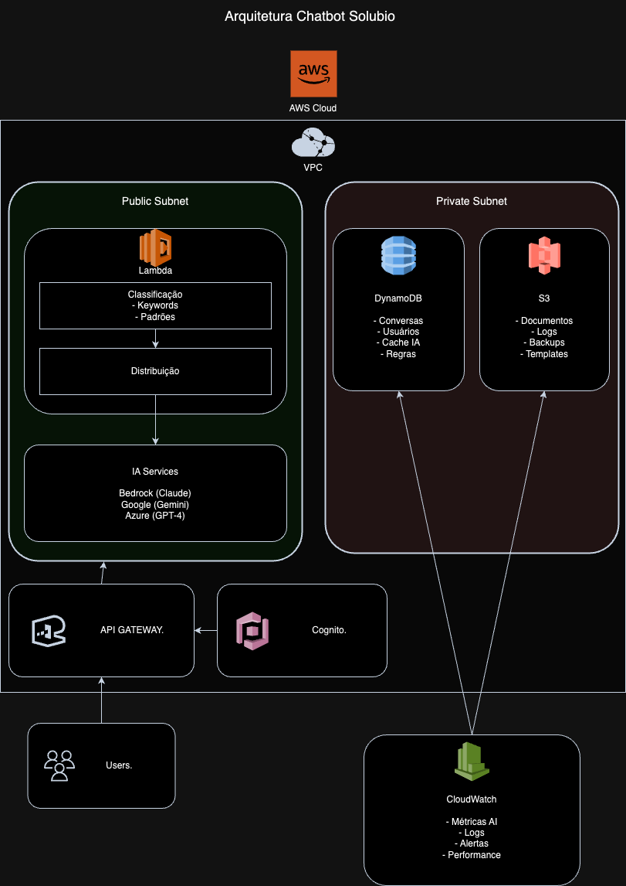
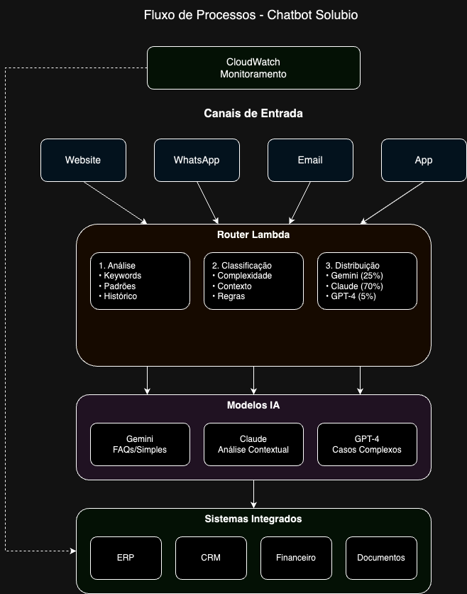
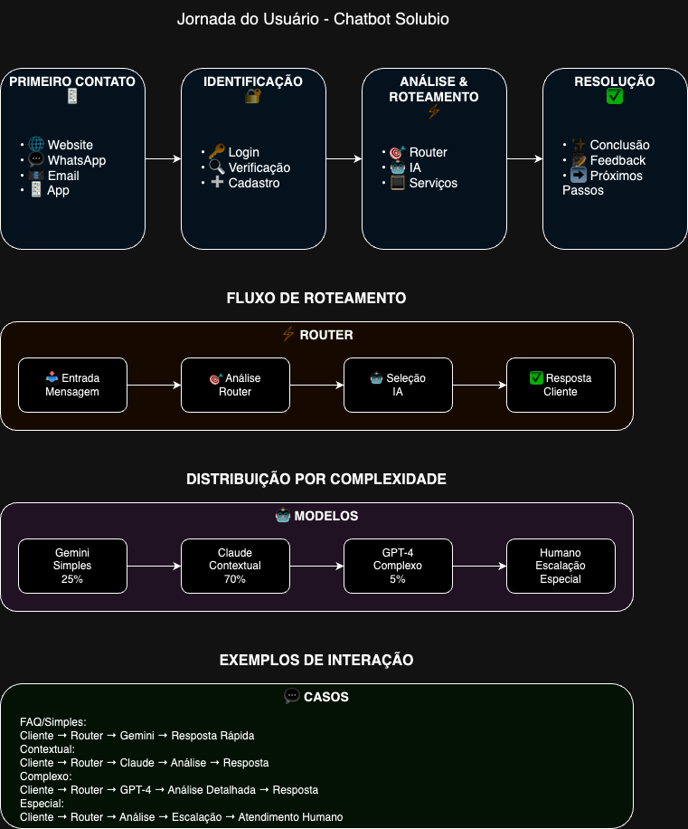

# FIAP - Faculdade de Informática e Administração Paulista

<p align="center">
<a href= "https://www.fiap.com.br/"></a>
</p>

<br>

# Chatbot Solubio - Atendimento Inteligente

## 🔗 Links Importantes
- [Documentação Técnica](docs/tech-arquitetura.md)
- [Especificações Técnicas](docs/especificacoes-tecnicas.md)
- [Análise de IA](docs/tech-ia.md)
- [Análise de Custos](docs/tech-custos.md)
- [Resultados Esperados](docs/business-resultados.md)
- [Referências](docs/referencias.md)

## 👨‍🎓 Integrantes: 
- <a href="https://www.linkedin.com/in/gabemule/">Gabriel Mule Monteiro</a>

## 👩‍🏫 Professores:
### Tutor(a) 
- <a href="https://www.linkedin.com/company/inova-fusca">Lucas Gomes Moreira</a>

## 📜 Descrição

Este projeto implementa um chatbot inteligente para a Solubio utilizando uma abordagem híbrida de IA que combina três modelos diferentes:
- Claude 3.5 Sonnet (AWS Bedrock) - 70% dos casos
- Gemini 1.5 Pro (Google) - 25% dos casos
- GPT-4o (Azure OpenAI) - 5% dos casos

O sistema realiza:
- Atendimento ao cliente 24/7
- Roteamento inteligente de mensagens
- Integração com sistemas internos
- Monitoramento em tempo real
- Análise contextual avançada

## 🏗 Arquitetura

<p align="center">

</p>

### Componentes Principais

1. Interface e Autenticação:
   - API Gateway para endpoints REST
   - WebSocket para chat em tempo real
   - Cognito para autenticação
   - Múltiplos canais de entrada

2. Processamento:
   - Router Lambda para classificação
   - Distribuição inteligente para IAs
   - Cache otimizado
   - Monitoramento CloudWatch

3. Armazenamento:
   - DynamoDB para dados dinâmicos
   - S3 para documentos e logs
   - Cache distribuído
   - Backup automático

### Fluxo de Processos

<p align="center">

</p>

O sistema utiliza um router inteligente que:
1. Analisa a mensagem recebida
2. Classifica por complexidade
3. Distribui para o modelo mais adequado
4. Monitora e ajusta baseado em feedback

### Jornada do Usuário

<p align="center">

</p>

A experiência do usuário é otimizada através de:
1. Múltiplos canais de entrada
2. Autenticação segura
3. Análise contextual
4. Respostas personalizadas

## 📁 Estrutura de Arquivos

```
my-challenge/
├── assets/
│   ├── arquitetura-aws.drawio     # Diagrama de arquitetura
│   ├── fluxo-processos.drawio     # Diagrama de processos
│   └── jornada-usuario.drawio     # Diagrama de jornada
├── docs/
│   ├── tech-arquitetura.md        # Arquitetura técnica
│   ├── tech-ia.md                 # Análise de IA
│   ├── tech-custos.md            # Análise de custos
│   ├── tech-validacao.md         # Validação técnica
│   ├── especificacoes-tecnicas.md # Especificações
│   ├── business-resultados.md    # Resultados esperados
│   └── referencias.md            # Referências e links
└── README.md                     # Este arquivo
```

### Documentos Principais:

1. **tech-arquitetura.md**:
   - Arquitetura AWS detalhada
   - Componentes e integrações
   - Fluxos de dados
   - Segurança e monitoramento

2. **tech-ia.md**:
   - Análise dos modelos de IA
   - Distribuição de carga
   - Performance e custos
   - Estratégias de cache

3. **tech-custos.md**:
   - Análise detalhada de custos
   - Free tier e limites
   - Otimizações
   - Projeções

## 💻 Funcionalidades

### Atendimento Inteligente

O sistema oferece:
- Atendimento 24/7
- Análise contextual
- Personalização
- Escalonamento automático

### Integrações

1. Sistemas Internos:
   - ERP
   - CRM
   - Financeiro
   - Base de conhecimento

2. Canais:
   - Website
   - WhatsApp
   - Email
   - App móvel

### Monitoramento

O sistema monitora:
- Performance dos modelos
- Custos por interação
- Satisfação do usuário
- Métricas técnicas

## 🗃 Histórico de lançamentos

* 0.1.0 - 21/03/2024
    * Arquitetura inicial
    * Análise de IA
    * Análise de custos
    * Diagramas técnicos
    * Documentação completa

## 📋 Licença

<p xmlns:cc="http://creativecommons.org/ns#" xmlns:dct="http://purl.org/dc/terms/">MODELO GIT FIAP por <a rel="cc:attributionURL dct:creator" property="cc:attributionName" href="https://fiap.com.br">Fiap</a> está licenciado sobre <a href="http://creativecommons.org/licenses/by/4.0/?ref=chooser-v1" target="_blank" rel="license noopener noreferrer" style="display:inline-block;">Attribution 4.0 International</a>.</p>
